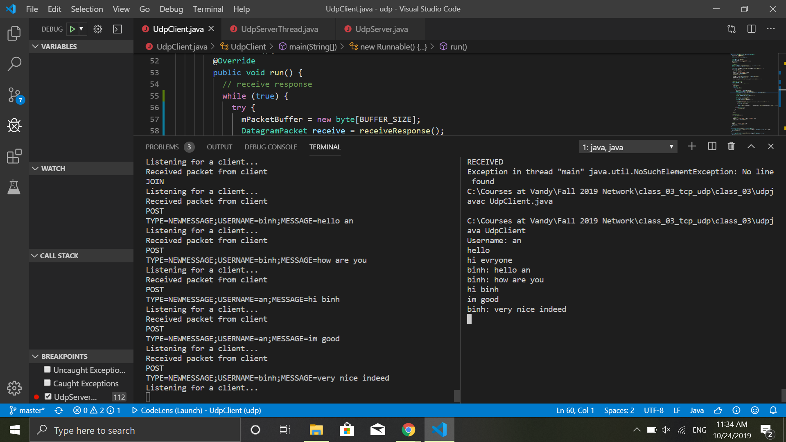
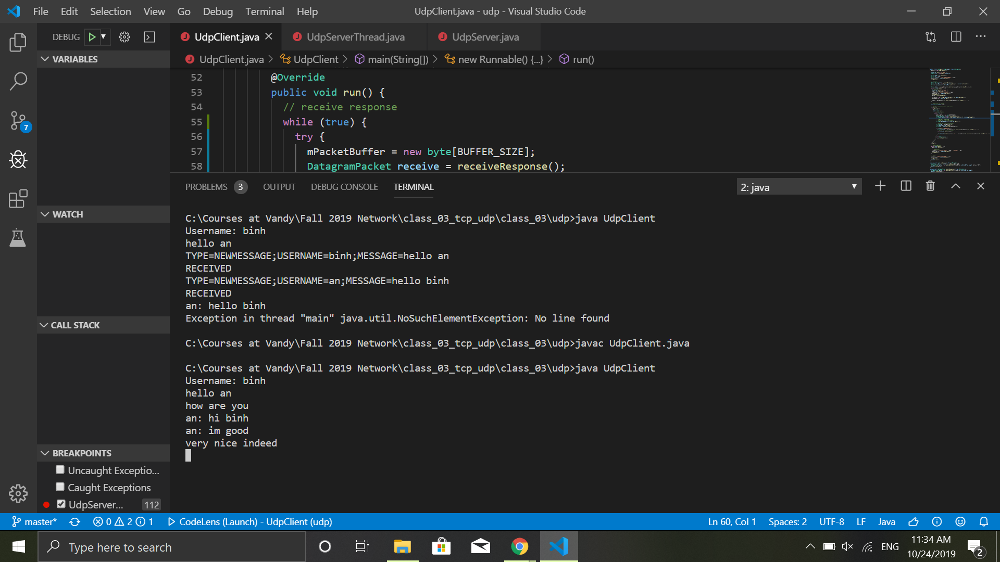

# HWK 03

## An Mai

 This project showcases UDP client and multiple servers. The client communicates with the server by protocols provided. Clients communicate with each other like a chat room. I test all cases with the help of logging.

 These images show the normal case of the chat room. 

- Clients chat an
 

- Clients chat binh
  

